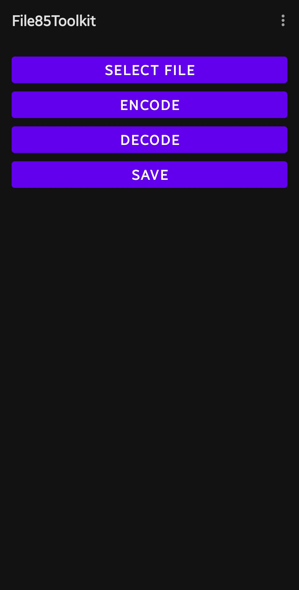
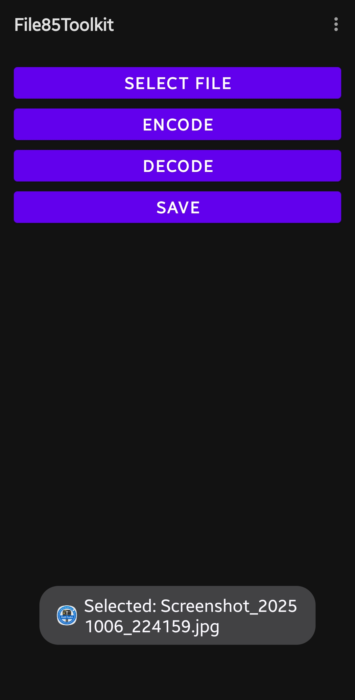
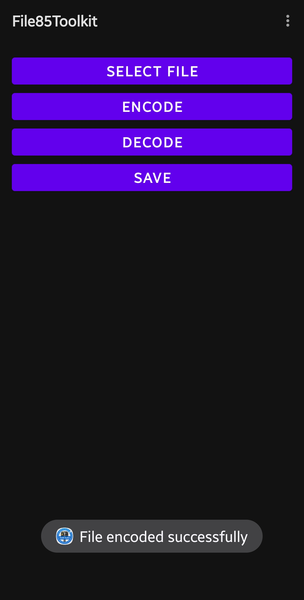
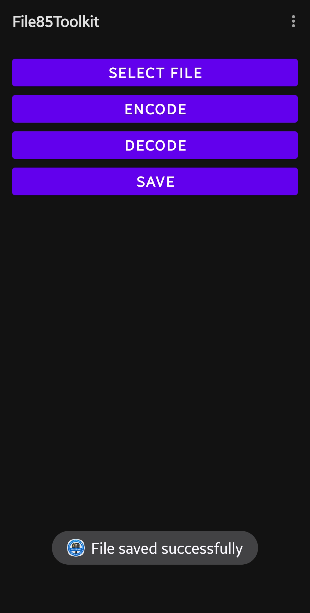

# File85Toolkit

File85Toolkit is an Android utility app designed for efficient **file compression and decompression** by combining two powerful techniques:

- **Compression**: Files are first compressed with the **LZMA (XZ)** algorithm, which reduces their size while preserving all data.  
- **Encoding**: The compressed output is then transformed into a **Base85 encoded string**, making it safe for storage, transfer, or embedding in text-based formats.  

- **Decompression**: When opening a file, the app reverses the process — it first **decodes the Base85 string back into binary data**, and then applies **LZMA decompression** to restore the original file in full.  

This approach makes File85Toolkit both lightweight and versatile, offering high comp# File85Toolkit

File85Toolkit is an Android utility app designed for efficient **file compression and decompression** using the Base85 algorithm and other optimized codecs.  
It provides a lightweight toolkit to pack, unpack, and manage files directly on Android devices, with support for modern UI components via **Jetpack Compose** and **Material 3**.

---

## ✨ Features

- 📦 Compression / decompression with Base85  
- ⚡ Additional codec support (LZMA/XZ via [XZ for Java](https://tukaani.org/xz/java.html))  
- 🎨 Material 3 / Jetpack Compose interface  
- 🛠 Termux-compatible Gradle build  
- 🚀 Open-source, lightweight, and optimized for Android 13+  

## 📸 Screenshots

<p align="center">
  
  
  
  
  
  
  
</p>

---

## 📥 Installation

- **Debug builds** can be found under [Releases](../../releases).  
- To build from source:

```bash
git clone https://github.com/YOUR_USERNAME/File85Toolkit.git
cd File85Toolkit
./gradlew assembleDebug```

### ⚡ Building in Termux
On some Termux setups, you may need a custom `aapt2` binary (e.g. from [Revancify](https://github.com/ReVanced/revancify)).

Add this line to your local `~/.gradle/gradle.properties`:

If you have Revancify installed, you can override the AAPT2 binary like this:
Add this line to your local ~/.gradle/gradle.properties (not committed to the repo):
Copy code
Properties
android.aapt2FromMavenOverride=/data/data/com.termux/files/home/Revancify/bin/aapt2

## Support
[](https://www.paypal.me/goofwear)

## 📜 License
Licensed under the MIT License. See [LICENSE](LICENSE) for details.
